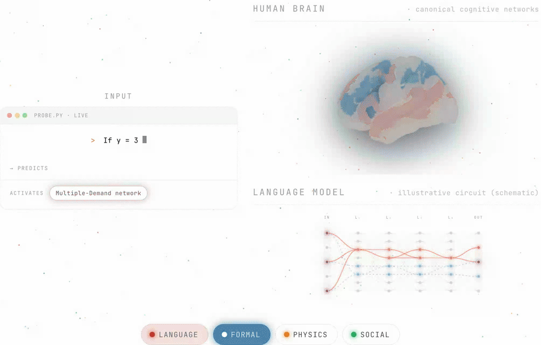

# Modular Cognitive Architecture Emerges in Large Language Models


<p align="left">
    <a href="https://pengrui-han.github.io/LLM_Modularity_Page/">
        
    </a>
    <a href="#">
        
    </a>
    <a href="LICENSE">
        
    </a>
</p>
<!-- arXiv badge is a placeholder; set the link + id on publication. -->

> **TL;DR** — Large language models develop segregated, domain-specific neuron
> populations that mirror the functional networks of the human brain.

<p align="center">
  
</p>
<p align="center"><sub><i>Interactive demo — schematic / illustrative, not a results figure.</i></sub></p>

Code and analysis pipeline for the study of **brain-like modular organization in
large language models**. We use attribution patching to localize the neurons
that support each of 46 reasoning tasks across four cognitive domains —
**Language**, **Formal reasoning (Multiple-Demand)**, **Physical reasoning**, and
**Social reasoning (Theory of Mind)** — and show, via neuron-overlap and causal
ablation, that LLMs develop segregated, domain-specific neuron populations that
mirror the functional networks of the human brain.

> 📄 Project page & paper link will be added upon publication.

---

## Repository structure

```
.
├── src/                 # Core library
│   ├── attribution.py   #   attribution patching (neurons & heads)
│   ├── ablation.py      #   corrupted-activation ablation
│   ├── metrics.py       #   full-sequence teacher-forcing metrics
│   ├── data_utils.py    #   data loading & prompt formatting
│   ├── model_utils.py   #   model loading (nnsight) & per-family config
│   └── chat_template.py #   per-model chat templates
├── scripts/             # Pipeline, figure, and statistics scripts (see below)
├── config/{Lan,MD,ToM,phys}/config.json   # 46-task definitions (prompt templates)
├── data/{Lan,MD,ToM,phys}/*.json          # 46 task datasets (clean/corrupted pairs)
├── figures/             # The four final paper figures (paper-numbered)
│   ├── fig2a_overlap_chord.pdf
│   ├── fig2b_layer_composition.{png,pdf}
│   ├── fig2c_within_vs_across_ablation.{png,pdf}
│   └── figS1_accuracy_heatmap.{png,pdf}
└── results/             # Lightweight derived data matrices (no figures, no tensors)
    ├── <model>/<domain>/<task>/baselines.json
    ├── <model>/overlap/*.csv                # per-model overlap matrices
    ├── <model>/ablation_analysis/*.csv      # per-model ablation matrices
    └── average/{overlap,ablation}/*.csv     # model-averaged matrices
```

**Note on large files.** Raw per-neuron attribution tensors
(`neuron_attribution.pt`, ~6.7 GB total) and the per-task-pair ablation JSON
files are **not** included — they are intermediate products that can be fully
regenerated from the scripts below. The repository ships only the small derived
matrices (CSV/JSON) and the final figures, which are sufficient to inspect every
number and reproduce every figure in the paper.

---

## Tasks (46)

| Domain | N | Tasks |
|---|---|---|
| **Language** | 8 | anaphor / det-noun (regular, irregular, with-adjective) / subject-verb agreement, NPI, hypernymy, wug |
| **Formal (Multiple-Demand)** | 20 | arithmetic ×9, logic ×4 (syllogistic & propositional, NL & symbolic), code ×5, number sorting/sequence ×2 |
| **Physical** | 9 | Newton, PROST, brightness, buoyancy, elasticity, solubility, speed, stability, temperature |
| **Social (Theory of Mind)** | 9 | agent, desires/goals, primary/secondary/few-shot emotions, social interactions/relations, norm appropriateness/morality |

Each task is a set of minimal **clean / corrupted** input pairs whose correct
continuation flips between the two. Task definitions live in
`config/<domain>/config.json`; the raw items in `data/<domain>/`.

## Models

Six instruction-tuned LLMs (24B–123B) — Mistral-Small-24B, Qwen2.5-32B,
OLMo-2-32B, Llama-3.1-70B, Qwen2.5-72B, Mistral-Large-123B — plus **GPT-2-small**
as a task-competence control (SI §5).

---

## Installation

```bash
pip install -r requirements.txt
# The chord diagram (Figure 2A) additionally needs R with: circlize, dplyr
```

---

## Pipeline

The full pipeline runs per model. Replace `<MODEL>` with a HuggingFace id
(e.g. `Qwen/Qwen2.5-32B-Instruct`).

**1. Baseline accuracy** (the 60% both-correct inclusion filter)
```bash
python scripts/run_eval.py --model <MODEL> --domain phys      # or --task <name>
```

**2. Attribution patching** (regenerates the `.pt` tensors)
```bash
python scripts/run_attribution.py --model <MODEL> --domain phys --component neurons
```

**3. Per-model neuron overlap** (top-k% Jaccard matrix)
```bash
python scripts/run_overlap.py --model <MODEL> --pct 0.1 --sign positive
```

**4. Causal ablation** (corrupted-activation, all source→target task pairs)
```bash
python scripts/run_ablation.py --model <MODEL> \
    --source-domain phys --target-domain phys \
    --component neurons --sign positive --pct 0.1 --ablation-type corrupted
python scripts/run_ablation_analysis.py --model <MODEL> --pct 0.1 --sign positive
```

**5. Model-averaged matrices** (inputs to Figures 2A/2C)
```bash
python scripts/run_overlap_avg_across_models.py  --pct 0.1 --sign positive
python scripts/run_ablation_avg_across_models.py --pct 0.1
```

## Reproducing the figures

The final figures are shipped under `figures/` (paper-numbered). Running the
scripts below regenerates them at each script's native output path under
`results/...`; the table lists both.

| Figure | Shipped as | Script | Regenerates at |
|---|---|---|---|
| **Fig 2A** — overlap chord diagram | `figures/fig2a_overlap_chord.pdf` | `Rscript scripts/run_overlap_chord.R` | `results/average/figures/…chord_5pct.pdf` |
| **Fig 2B** — layer-wise composition | `figures/fig2b_layer_composition.{png,pdf}` | `python scripts/plot_layer_stacked.py` | `results/figures/layer_stacked_domain_composition.png` |
| **Fig 2C** — within vs. cross ablation | `figures/fig2c_within_vs_across_ablation.{png,pdf}` | `python scripts/plot_ablation_within_vs_across_3bar.py` | `results/average/figures/…within_vs_across_3bar.png` |
| **SI Fig 1** — per-task accuracy heatmap | `figures/figS1_accuracy_heatmap.{png,pdf}` | `python scripts/plot_accuracy_heatmap.py` | `results/figures/accuracy_heatmap_both_correct.png` |

## Statistical analyses

| Analysis | Script |
|---|---|
| Within- vs. cross-domain permutation test + ARI clustering recovery | `scripts/test_overlap_ari_perm.py` |
| Cross-model consistency (Kendall's τ) on the ablation matrix | `scripts/test_ablation_cross_model_kendall.py` |
| Per-model modularity summary (SI Table 1) | `scripts/per_model_modularity_summary.py` |
| Per-domain modularity breakdown (SI Table 2) | `scripts/per_domain_modularity.py` |
| Threshold robustness sweep, 0.05–5% (SI §4) | `scripts/overlap_threshold_sweep_tests.py` |

---

## Method in brief

For each MLP neuron *i*: `attribution_i = (clean_actᵢ − corrupted_actᵢ) · ∇ᵢ metric`,
evaluated at the final prompt token with full-sequence teacher forcing. The
top-0.1% positively attributed neurons define a task's circuit; pairwise Jaccard
overlap quantifies structural modularity, and corrupted-activation ablation
across task pairs (source ≠ target) tests causal specificity. See the paper for
full details.

## Citation

```
TBD — citation will be added upon publication.
```

## License

MIT — see [LICENSE](LICENSE). © 2026 Pengrui Han, MIT.
